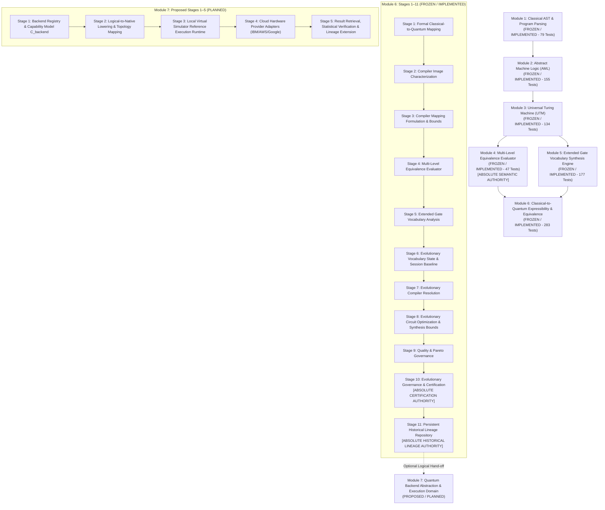

# PROJECT-WIDE END-STATE MODULE GRAPH & IMPLEMENTATION ROADMAP

## 1. Master End-State Module Dependency Graph



---

## 2. Module Boundaries & Authority Isolation

1. **Module 1–5**: Classical parsing, AST, Abstract Machine Logic, Universal Turing Machine, and Level 6 Semantic Equivalence (Module 4).
2. **Module 6 (Stages 1–11)**: Compiler Intelligence Domain. Converts classical logic into optimized, certified, and lineage-tracked logical quantum circuits.
   - **Stage 4**: Absolute Semantic Authority.
   - **Stage 10**: Absolute Certification Authority.
   - **Stage 11**: Absolute Historical Lineage Authority.
3. **Module 7 (Proposed Stages 1–5)**: Execution Domain. Handles target backend abstraction, lowering/transpilation, local virtual reference execution, cloud hardware adapters, and execution result verification.

---

## 3. Proposed Implementation Order for Execution Domain (Module 7)

```
[Module 7 Stage 1: Backend Abstraction & Capability Model C_backend]
                            ↓
[Module 7 Stage 2: Logical-to-Native Lowering & Topology Mapping Engine]
                            ↓
[Module 7 Stage 3: Local Virtual Simulator Reference Execution Runtime] (LOCAL FIRST POLICY)
                            ↓
[Module 7 Stage 4: Cloud Hardware Provider Adapters (IBM / AWS / Google)]
                            ↓
[Module 7 Stage 5: Execution Result Retrieval, Statistical Verification & Lineage Extension]
```

- **Local Simulator First Policy**: Module 7 Stage 3 establishes a deterministic local virtual simulator reference execution runtime prior to cloud hardware integration (Stage 4), enabling complete off-line verification without external API network dependencies or hardware execution costs.
