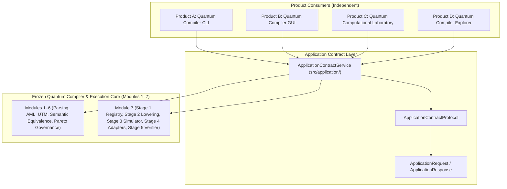

# APPLICATION / PRODUCT LAYER — DEPENDENCY GRAPH

```mermaid
graph TD
    subgraph Products ["Product Consumers (Independent)"]
        CLI["Product A: Quantum Compiler CLI"]
        GUI["Product B: Quantum Compiler GUI"]
        LAB["Product C: Quantum Computational Laboratory"]
        EXP["Product D: Quantum Compiler Explorer"]
    end

    subgraph AppLayer ["Application Contract Layer"]
        SERVICE["ApplicationContractService (src/application/)"]
        CONTRACT["ApplicationContractProtocol"]
        MODEL["ApplicationRequest / ApplicationResponse"]
    end

    subgraph Core ["Frozen Quantum Compiler & Execution Core (Modules 1–7)"]
        MOD1_6["Modules 1–6 (Parsing, AML, UTM, Semantic Equivalence, Pareto Governance)"]
        MOD7["Module 7 (Stage 1 Registry, Stage 2 Lowering, Stage 3 Simulator, Stage 4 Adapters, Stage 5 Verifier)"]
    end

    CLI --> SERVICE
    GUI --> SERVICE
    LAB --> SERVICE
    EXP --> SERVICE

    SERVICE --> CONTRACT
    CONTRACT --> MODEL

    SERVICE --> MOD1_6
    SERVICE --> MOD7
```
