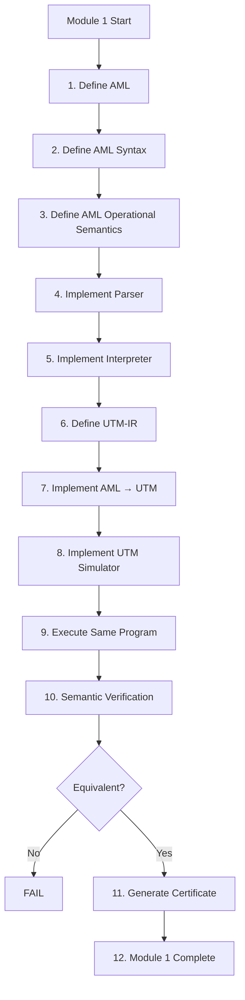

# Module 1 — AML to UTM

## Objective

Establish the first executable PoC edge of the compiler:

```text
AML
 ↓
AML-IR
 ↓
UTM-IR
 ↓
UTM Simulator
 ↓
Semantic Verification
 ↓
Certificate
```

The target claim is:

```text
Sem_AML(P) = Sem_UTM(T(P))
```

for the defined observable semantics and finite test domain.

## Waterfall



## Stage contracts

### Stage 1 — AML definition

Define the minimal AML instruction set:

```text
LOAD
STORE
MOV
ADD
SUB
MUL
CMP
JMP
JZ
JNZ
HALT
```

Acceptance:

- syntax is defined;
- operands are defined;
- invalid instructions are identifiable.

### Stage 2 — Syntax

Define the textual grammar and deterministic parsing rules.

### Stage 3 — Semantics

Define:

```text
S = (PC, R, M, F)
```

and the state transition for every instruction.

### Stage 4 — Parser

Produce AML-IR from valid AML source and explicit errors from invalid
source.

### Stage 5 — Interpreter

Execute AML-IR as the reference semantics.

### Stage 6 — UTM-IR

Define states, tape symbols, transition rules, configuration, initial
state, and halting state.

### Stage 7 — Translator

Implement:

```text
T : AML-IR → UTM-IR
```

Each AML instruction must map to a finite UTM transition sequence.

### Stage 8 — UTM Simulator

Execute UTM-IR and expose:

- final result;
- halt status;
- step count;
- space/tape usage.

### Stage 9 — Dual execution

Run the same algorithm through:

```text
AML Interpreter
```

and:

```text
AML → UTM → UTM Simulator
```

### Stage 10 — Verification

Check observable semantic equivalence.

Do not require equal step counts.

### Stage 11 — Certificate

Generate a deterministic certificate for successful verification.

### Stage 12 — Completion

All tests pass and the documentation matches the implementation.

## First PoC

```text
LOAD R1, A
LOAD R2, B
ADD  R1, R2
STORE OUT, R1
HALT
```

Input:

```text
A = 5
B = 7
```

Expected:

```text
OUT = 12
```

## Boundary

Module 1 ends at:

```text
AML → UTM → Verification → Certificate
```

It does not implement:

```text
UTM → RUTM
RUTM → QTM
QTM → Quantum Circuit
```

## Completion checklist

- [ ] AML syntax
- [ ] AML semantics
- [ ] parser
- [ ] interpreter
- [ ] UTM-IR
- [ ] UTM simulator
- [ ] translator
- [ ] semantic verifier
- [ ] negative verification test
- [ ] certificate
- [ ] first PoC
