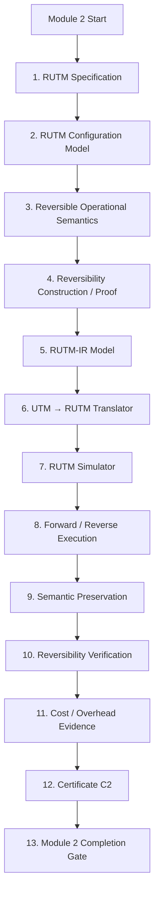

# Module 2 — UTM to Reversible UTM

## Objective

Establish the second executable/proof-oriented edge of the compiler:

```text
UTM-IR
 ↓
RUTM-IR
 ↓
Reversible UTM Simulator
 ↓
Forward / Reverse Execution
 ↓
Semantic Preservation Verification
 ↓
Reversibility Verification
 ↓
Certificate C2
```

The central research question is:

> Can the finite deterministic UTM computation represented by the
> existing UTM-IR be lifted into an explicitly reversible computational
> model by preserving sufficient auxiliary/history information, while
> preserving the original observable semantics?

## Initial mathematical target

For a UTM configuration:

```text
C = (q, tape, head)
```

investigate an extended reversible configuration of the general form:

```text
CR = (q, tape, head, H)
```

where `H` is auxiliary/history information.

A candidate reversible transition has the form:

```text
R(C, H) = (C', H')
```

with an executable inverse satisfying:

```text
R⁻¹(C', H') = (C, H)
```

on the formally specified domain.

This is a candidate construction, not an assumption that has already
been proven.

## Waterfall



## Stage contracts

### Stage 1 — RUTM Specification

Define precisely what the project means by RUTM and reversible
computation.

Acceptance must include:

- configuration model;
- transition function;
- inverse transition concept;
- domain/codomain;
- reversibility definition;
- history/auxiliary assumptions;
- HALT semantics;
- invariants;
- proof obligations;
- explicit non-claims about thermodynamics.

No implementation beyond specification artifacts.

### Stage 2 — RUTM Configuration Model

Formalize the extended configuration and equality relation.

### Stage 3 — Reversible Operational Semantics

Define forward and inverse transition semantics.

### Stage 4 — Reversibility Construction / Proof

Prove the chosen local construction is reversible on its stated domain.
If the proposed history construction is insufficient, revise the
construction before implementation.

### Stage 5 — RUTM-IR Model

Create an executable IR representing the mathematically specified RUTM.

### Stage 6 — Translator

Implement:

```text
T2 : UTM-IR → RUTM-IR
```

while preserving the source UTM transition semantics.

### Stage 7 — RUTM Simulator

Implement faithful single-step forward execution and the corresponding
reverse execution mechanism.

### Stage 8 — Forward / Reverse Execution

For a finite run:

```text
C0 → C1 → ... → Cn
```

verify that reverse execution can recover the initial reversible state.

### Stage 9 — Semantic Preservation

Compare observable UTM and RUTM results.

### Stage 10 — Reversibility Verification

Verify the inverse property from actual configurations/traces, not only
from final observable output.

### Stage 11 — Cost / Overhead Evidence

Record transition expansion, auxiliary/history space, tape usage, and
other overhead without optimizing the construction.

### Stage 12 — Certificate C2

Generate a deterministic auditable certificate containing translation,
semantic-preservation, and reversibility evidence.

### Stage 13 — Completion Gate

Audit all stages and determine whether Module 2 is complete.

## Mathematical boundary

Module 2 may establish logical/computational reversibility of the chosen
RUTM model.

Module 2 does not automatically establish thermodynamic reversibility.

In particular, do not infer:

```text
logical reversibility
    ⇒
zero entropy production
```

without an independent physical argument.

## Scientific claim boundary

Finite tests may establish empirical verification for tested instances.
They do not by themselves establish:

```text
∀ UTM programs,
Sem_UTM(P) = Sem_RUTM(T2(P))
```

or a universal reversibility theorem.

A universal theorem requires a mathematical proof independent of the
finite test suite.

## Module 2 completion target

The intended endpoint is:

```text
UTM-IR
 ↓
RUTM-IR
 ↓
Forward execution
 ↓
Reverse execution
 ↓
Semantic preservation
 ↓
Reversibility verification
 ↓
Certificate C2
```

Module 2 ends before:

```text
RUTM → QTM/QUTM
QTM/QUTM → Quantum Circuit
Quantum Cloud Execution
```
