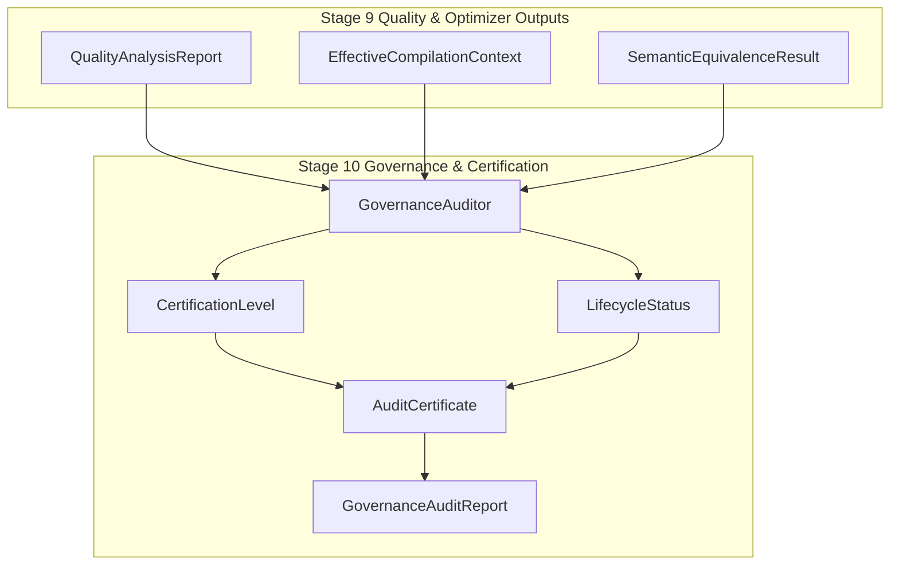

# MODULE 6 STAGE 10 — STAGE-SPECIFIC DEPENDENCY GRAPH

```mermaid
graph TD
    subgraph Stage 9 Quality & Optimizer Outputs
        S9_Report["QualityAnalysisReport"]
        S7_Context["EffectiveCompilationContext"]
        S4_Eq["SemanticEquivalenceResult"]
    end

    subgraph Stage 10 Governance & Certification
        S10_Auditor["GovernanceAuditor"]
        S10_Cert["AuditCertificate"]
        S10_Level["CertificationLevel"]
        S10_Status["LifecycleStatus"]
        S10_Report["GovernanceAuditReport"]
    end

    S9_Report --> S10_Auditor
    S7_Context --> S10_Auditor
    S4_Eq --> S10_Auditor
    S10_Auditor --> S10_Level
    S10_Auditor --> S10_Status
    S10_Level --> S10_Cert
    S10_Status --> S10_Cert
    S10_Cert --> S10_Report
```
