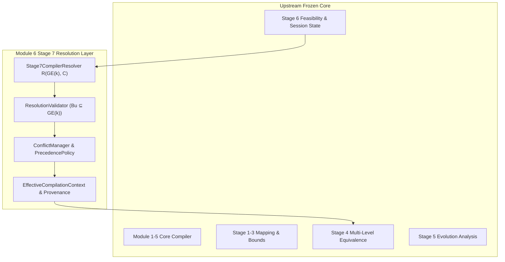

# Module 6 Stage 7 — Architectural Graph & Control Flow

## 1. Executive Summary

Architectural visualization of Stage 7 Compiler Resolution layer.

---

```mermaid
graph TD
    subgraph Upstream Frozen Core
        M1["Module 1-5 Core Compiler"]
        M6_S1["Stage 1-3 Mapping & Bounds"]
        M6_S4["Stage 4 Multi-Level Equivalence"]
        M6_S5["Stage 5 Evolution Analysis"]
        M6_S6["Stage 6 Feasibility & Session State"]
    end

    subgraph Module 6 Stage 7 Resolution Layer
        S7_1["Stage7CompilerResolver R(GE(k), C)"]
        S7_2["ResolutionValidator (Bu ⊆ GE(k))"]
        S7_3["ConflictManager & PrecedencePolicy"]
        S7_4["EffectiveCompilationContext & Provenance"]
    end

    M6_S6 --> S7_1
    S7_1 --> S7_2
    S7_2 --> S7_3
    S7_3 --> S7_4
    S7_4 --> M6_S4
```
