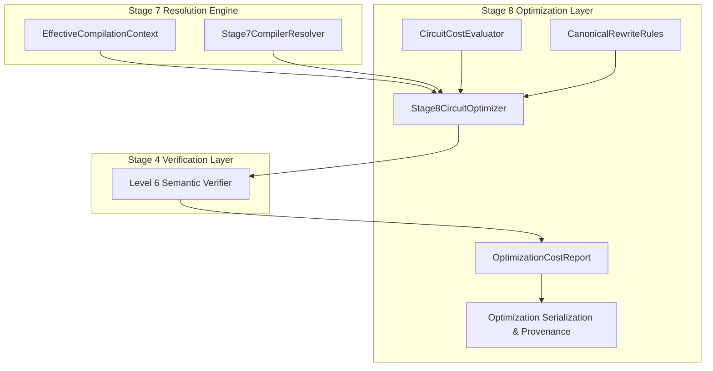

# MODULE 6 STAGE 8 — STAGE-SPECIFIC DEPENDENCY GRAPH

```mermaid
graph TD
    subgraph Stage 7 Resolution Engine
        S7_Ctx["EffectiveCompilationContext"]
        S7_Res["Stage7CompilerResolver"]
    end

    subgraph Stage 8 Optimization Layer
        S8_Evaluator["CircuitCostEvaluator"]
        S8_Rules["CanonicalRewriteRules"]
        S8_Optimizer["Stage8CircuitOptimizer"]
        S8_Report["OptimizationCostReport"]
        S8_Ser["Optimization Serialization & Provenance"]
    end

    subgraph Stage 4 Verification Layer
        S4_L6["Level 6 Semantic Verifier"]
    end

    S7_Ctx --> S8_Optimizer
    S7_Res --> S8_Optimizer
    S8_Evaluator --> S8_Optimizer
    S8_Rules --> S8_Optimizer
    S8_Optimizer --> S4_L6
    S4_L6 --> S8_Report
    S8_Report --> S8_Ser
```
