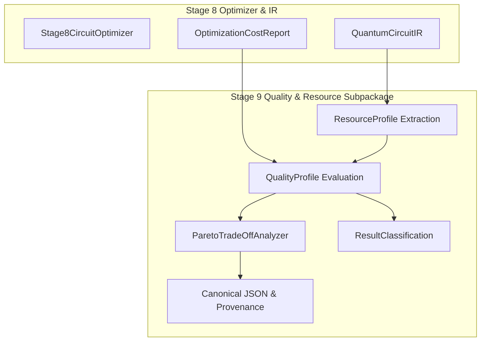

# MODULE 6 STAGE 9 — STAGE-SPECIFIC DEPENDENCY GRAPH

```mermaid
graph TD
    subgraph Stage 8 Optimizer & IR
        S8_Opt["Stage8CircuitOptimizer"]
        S8_Rep["OptimizationCostReport"]
        IR["QuantumCircuitIR"]
    end

    subgraph Stage 9 Quality & Resource Subpackage
        S9_Resource["ResourceProfile Extraction"]
        S9_Quality["QualityProfile Evaluation"]
        S9_Pareto["ParetoTradeOffAnalyzer"]
        S9_Class["ResultClassification"]
        S9_Ser["Canonical JSON & Provenance"]
    end

    IR --> S9_Resource
    S8_Rep --> S9_Quality
    S9_Resource --> S9_Quality
    S9_Quality --> S9_Class
    S9_Quality --> S9_Pareto
    S9_Pareto --> S9_Ser
```
