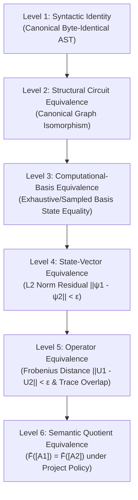

# MODULE 6 — STAGE 4: MULTI-LEVEL EQUIVALENCE EVALUATOR & MAPPING ANALYZER
## Technical Architecture & Mathematical Specification

---

### Executive Summary

Module 6 Stage 4 establishes a formally governed, deterministic, provenance-preserving multi-level equivalence evaluation framework for the compiler mapping:

$$\mathcal{F} : \mathcal{A}_C \to \mathcal{C}_Q^{\text{logical}}$$

The framework introduces a **6-level equivalence taxonomy**, non-phase/phase overlap metrics, 3x3 mapping preservation and collision classification matrices, and Hadamard regression verification under frozen upstream constraints.

---

### 1. Multi-Level Equivalence Hierarchy (L1 – L6)

#### Hierarchy Specifications & Distinctions

1. **Level 1 — Syntactic Identity (`SYNTACTIC_IDENTICAL` / `SYNTACTIC_DIFFERENT`)**:
   - Compares canonical JSON string representation of `QuantumCircuitIR` ASTs.
2. **Level 2 — Structural Circuit Equivalence (`STRUCTURAL_EQUIVALENT` / `STRUCTURAL_DIFFERENT`)**:
   - Compares register topologies, wire mappings, and canonical gate operation sequences.
3. **Level 3 — Computational-Basis Equivalence (`BASIS_EQUIVALENT`, `BASIS_NON_EQUIVALENT`, `BASIS_INCONCLUSIVE`)**:
   - Evaluates $\forall x \in \{0,1\}^N: U_1|x\rangle = U_2|x\rangle$.
   - **Exhaustive Threshold Policy**: If $2^N \le 1024$, performs exhaustive basis enumeration. If $2^N > 1024$, returns `BASIS_INCONCLUSIVE` unless separate structural proof exists.
4. **Level 4 — State-Vector Equivalence (`EXACT_STATE_EQUIVALENCE`, `GLOBAL_PHASE_EQUIVALENCE`, `STATE_NON_EQUIVALENCE`)**:
   - Evaluates state-vector overlap over deterministic test state suite (basis states, uniform superposition, random real/complex unit vectors).
   - **Exact State Equivalence**: $\|\psi_1 - \psi_2\|_2 < 10^{-12}$.
   - **Global Phase Equivalence**: $|\langle \psi_1 | \psi_2 \rangle| \ge 1 - 10^{-12}$.
5. **Level 5 — Operator Equivalence (`OPERATOR_IDENTICAL`, `OPERATOR_EQUIVALENT`, `OPERATOR_EQUIVALENT_UP_TO_GLOBAL_PHASE`, `OPERATOR_NON_EQUIVALENT`)**:
   - Evaluates dense/sparse unitary matrix Frobenius distance $\|U_1 - U_2\|_F < 10^{-12}$ and normalized trace overlap $\frac{1}{d}|\text{Tr}(U_1^\dagger U_2)| \ge 1 - 10^{-12}$.
   - Unitarity condition $\|U^\dagger U - I\| < 10^{-12}$ and $\|U U^\dagger - I\| < 10^{-12}$ enforced.
6. **Level 6 — Semantic Quotient Equivalence (`SEMANTICALLY_EQUIVALENT` / `SEMANTICALLY_NON_EQUIVALENT`)**:
   - Evaluates quotient class identity $\bar{\mathcal{F}}([A_1]) = \bar{\mathcal{F}}([A_2])$ under frozen project policy.

---

### 2. Mandatory Non-Implications & Non-Collapses

The evaluation framework enforces strict isolation of equivalence levels. The following non-implications are verified by unit tests:

1. $\text{Level 2 Structural Difference} \centernot\implies \text{Level 6 Semantic Difference}$ (e.g. $X \cdot X \cdot X \equiv_Q X$).
2. $\text{Level 5 Operator Equivalence} \centernot\implies \text{Level 2 Structural Equivalence}$.
3. $\text{Global Phase Equivalence} \centernot\implies \text{Exact State Equivalence}$.
4. $\text{No Collision Observed} \centernot\implies \text{Injectivity Proven}$.
5. $\text{Finite Basis Testing} \centernot\implies \text{Universal Equivalence Beyond Tested Domain}$.

---

### 3. Collision Matrix & Classification Taxonomy

The framework evaluates classical vs quantum equivalence over pairs $(A_1, A_2)$:

| Classical Relation ($A_1 \equiv_C A_2$) | Quantum Relation ($\mathcal{F}(A_1) \equiv_Q \mathcal{F}(A_2)$) | Semantic Classification | Description |
| :--- | :--- | :--- | :--- |
| **Equivalent** | **Equivalent** | `TYPE_A` | Preserved Classical Equivalence |
| **Equivalent** | **Non-Equivalent** | `TYPE_B` | Preserving Violation (Compiler Instability) |
| **Non-Equivalent** | **Equivalent** | `TYPE_C` | Compiler Collisions (Semantic Convergence) |
| **Non-Equivalent** | **Non-Equivalent** | `TYPE_D` | Preserved Distinction |

---

### 4. Hadamard Operator Regression Result

- **Target Operator**: $H = \frac{1}{\sqrt{2}}\begin{pmatrix} 1 & 1 \\ 1 & -1 \end{pmatrix}$.
- **Verification Result**: $H \notin \text{Img}_Q(\mathcal{F})$.
- **Hadamard Regression Status**: `PASS`.
- **Reason**: All compiler-generated operators $\mathcal{F}(A)$ remain basis permutation operators within $\text{Perm}(2^N)$, preserving zero superposition creation from computational basis inputs.
