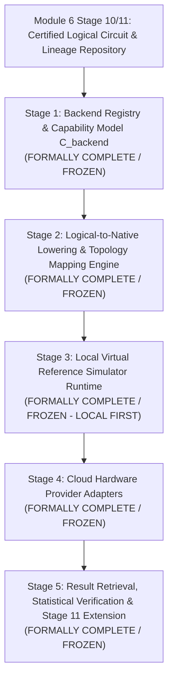

# MODULE 7 — STAGE GRAPH

```mermaid
graph TD
    M6["Module 6 Stage 10/11: Certified Logical Circuit & Lineage Repository"] --> S1["Stage 1: Backend Registry & Capability Model C_backend<br/>(FORMALLY COMPLETE / FROZEN)"]
    S1 --> S2["Stage 2: Logical-to-Native Lowering & Topology Mapping Engine<br/>(FORMALLY COMPLETE / FROZEN)"]
    S2 --> S3["Stage 3: Local Virtual Reference Simulator Runtime<br/>(FORMALLY COMPLETE / FROZEN - LOCAL FIRST)"]
    S3 --> S4["Stage 4: Cloud Hardware Provider Adapters<br/>(FORMALLY COMPLETE / FROZEN)"]
    S4 --> S5["Stage 5: Result Retrieval, Statistical Verification & Stage 11 Extension<br/>(FORMALLY COMPLETE / FROZEN)"]
```
